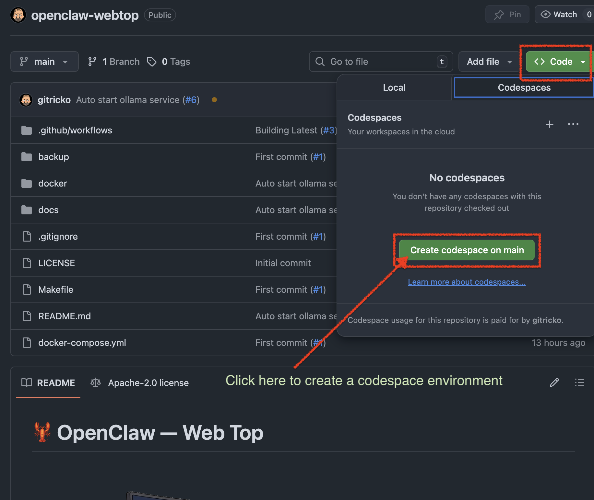
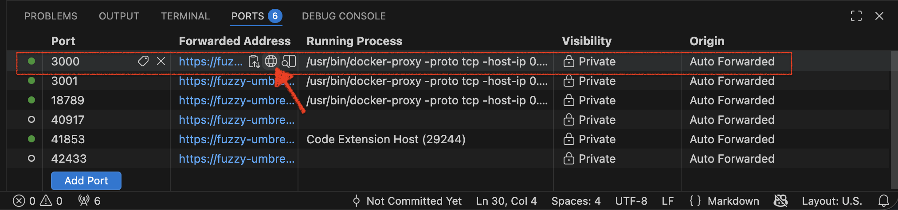
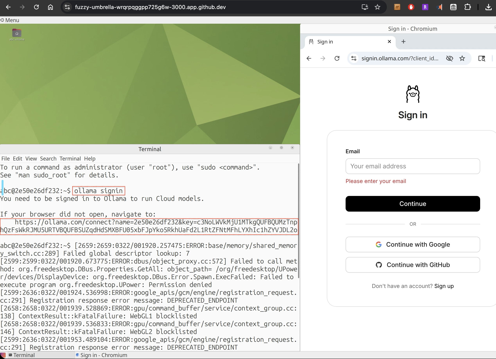

# 🦞 OpenClaw — Web Top

<p align="center">
    <picture>
        
    </picture>
</p>

<p align="center">
  <strong>Brew your lobster securely without breaking your bank</strong>
</p>

<p align="center">
<a href="https://github.com/gitricko/openclaw-webtop/actions/workflows/docker-publish.yml">
    
  </a>
  <a href="LICENSE">
    
  </a>
  <a href="https://github.com/gitricko/openclaw-webtop/issues">
    
  </a>
</p>

**OpenClaw-WebTop** gives you a **fully functional OpenClaw personal AI assistant** in your browser in under 10 minutes — no powerful PC, no Docker on your machine, no GPU required.

Just open this repo in a GitHub Codespace and you get:
- A complete Ubuntu MATE desktop (WebTop)
- Ollama server pre-installed and auto-started
- OpenClaw globally installed via npm
- Persistent volume for your config, pairings, and OpenClaw ID

When you’re ready to go production, simply move the same Docker setup to your own machine or VPS. *

## ✨ Why This Exists

OpenClaw (the core project) is one of the most exciting AI agent frameworks right now — it connects LLMs directly to your WhatsApp, Telegram, Slack, Discord, etc., and can run cron jobs, spawn sub-agents, speak/listen, and give you a beautiful dashboard.

The only catch? You normally need a dedicated machine.  
**OpenClaw-WebTop removes that catch completely.**

Perfect for:
- Trying OpenClaw risk-free
- Students / hackers / evaluators
- Anyone who wants to “brew their lobster” securely on free cloud credits


## 🚀 Quick Start (5–10 minutes)

1. **Open this repository in a GitHub Codespace** (big green “Code” button → Codespaces → New)
   
3. In the Codespace terminal run:
   ```bash
   make start
   ```
   (or make start-locally-baked if you prefer a pre-built image)
4. Wait ~60 seconds. When the web desktop URL appears in the Codespace Ports tab, click it.
   

5. Inside the WebTop desktop:
- Open a terminal → `ollama signin` (sign in via the Chromium browser that pops up) 
- Pull a model: `ollama pull kimi-k2.5:cloud` (or any model you like)
- Launch: `ollama launch openclaw --model kimi-k2.5:cloud`
- (After first launch) `openclaw gateway run` or `openclaw gateway restart`
- Finally: `openclaw dashboard` → copy the tokenized URL

5. Open Chromium inside WebTop and paste the dashboard URL.
You now have a **fully working OpenClaw instance running 100% in the cloud.**

## 🔧 Features

- **Zero local install** — everything runs in browser via GitHub Codespaces
- **Free-tier friendly** — uses Ollama daily cloud credits + NVIDIA Build API fallback
- **Persistent config** — if docker volume backup and restore after Codespace recreation
- **Easy backup/restore** — `make backup` / `make restore`
- **One-command everything** — powerful Makefile + clean `docker-compose.yml`
- **Auto-start Ollama** — custom init script on WebTop boot
- **NVIDIA Build fallback** built-in
- **Colima / local Docker support** ready

## 🔒 Security: Protected by GitHub Authentication

**The WebTop URI is automatically protected — no one else can reach it.**

GitHub Codespaces forwards ports **privately by default** (this is the setting the `make start` command uses). According to official [GitHub documentation](https://docs.github.com/en/enterprise-cloud@latest/codespaces/reference/security-in-github-codespaces):

> “All forwarded ports are private by default, which means that you will need to authenticate before you can access the port.”  
> “Privately forwarded ports: Are accessible on the internet, but **only the codespace creator can access them, after authenticating to GitHub**.”

### How the protection actually works
- The URL you click in the **Ports** tab (`https://<your-codespace>-3000.app.github.dev`) is guarded by **GitHub authentication cookies**.
- These cookies expire every **3 hours** — you’ll simply be asked to log in again (super quick).
- If someone tries to open the link in an incognito window, via curl, or from another computer without being logged into **your** GitHub account, they are redirected to the GitHub login page or blocked.
- You (and only you) can access the full Ubuntu desktop, the browser inside it, Ollama, OpenClaw dashboard, and everything else.

### Extra security layers built-in
- The entire environment runs in an **isolated GitHub-managed VM** — not on your laptop.
- Codespaces are **ephemeral**: delete the codespace and everything disappears (except the backed-up volume you control).
- TLS encryption is handled automatically by GitHub.
- The `GITHUB_TOKEN` inside the codespace is scoped only to this repo and expires when you stop/restart.
- We never set the port to “Public” or even “Private to Organization” — it stays strictly private to you.

**Bottom line**: This is actually **more secure** for experimentation than running Docker locally on your personal machine (no accidental exposure, no firewall holes, no persistent processes on your hardware).

**For production use** we still recommend moving the same Docker image to your own VPS or server with additional hardening (firewall, HTTPS reverse proxy, strong secrets, etc.). This Codespace version is perfect for safe testing and development.

## 💾 Backup & Restore
Your OpenClaw ID, pairings, and config are stored in a Docker volume.
Use the built-in targets:
```bash
make backup          # creates backup/openclaw-webtop.tar.gz
make restore         # restores from the latest backup
make clean           # full cleanup
```

## 🛠️ Advanced Usage
Run locally (no Codespaces)
```bash
make build-local             # especially if you modified the ./docker/Dockerfile
make start-locally-baked     # start from your local bake image
```

### NVIDIA Build API fallback
Just sign in at [NVIDIA Build](https://build.nvidia.com/) and create a API. Prompt OpenClaw to configure NVIDIA API keys and models as backup before Ollama cloud credits run out. There are many youtube videos out there that teaches you how to do this. More documentation will follow.


## ⚠️ Current Limitations (honest)

- GitHub Codespaces free tier has monthly limits (great for testing, less ideal for 24/7 as Codespace auto-shutdown during inactivity)
- Ollama cloud [credits](https://ollama.com/settings) are daily — heavy use will push you to paid/local models
- Browser desktop has slight latency vs native (expected)
- Still very early (single maintainer, day-1 project)

## 📸 Screenshots / Videos
Coming soon
<!--
Dashboard running inside WebTop
WhatsApp pairing flow
Agent in action
-->

## 🛣️ Roadmap

 - [ ] More screenshots + video demo
 - [ ] Full pairing automation scripts
 - [ ] Pre-built Docker image tags for stable releases
 - [ ] Community templates (Telegram-only, WhatsApp-only, etc.)
 - [ ] One-click “deploy to VPS” guide (Railway / Fly.io / cheap VPS) ?

## 🤝 Contributing
This is a one-person weekend project right now — every star, issue, or PR helps enormously!
Feel free to open issues for bugs or feature requests.

[](https://www.star-history.com/#gitricko/openclaw-webtop&type=date&legend=top-left)

## 📄 License
Apache-2.0 — see [LICENSE](./LICENSE)
